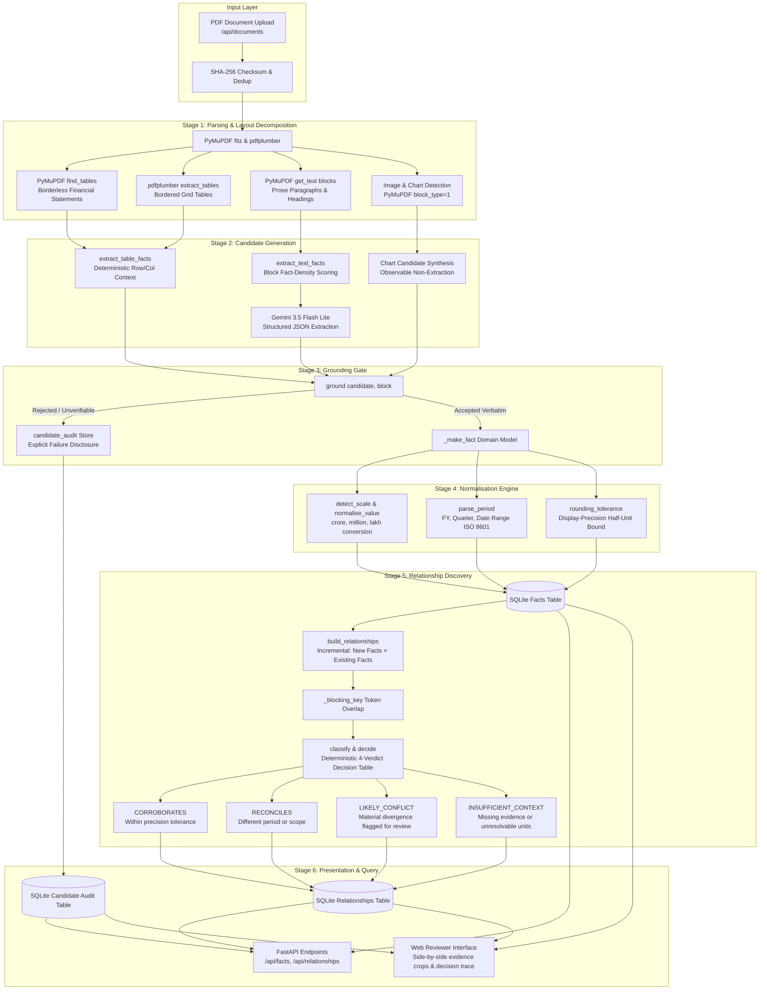
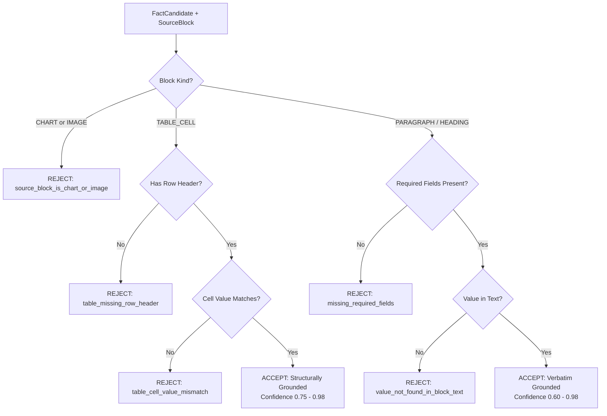

# Complete Architecture and Functional Specification: Fact Knowledge Layer (FKL)

This document provides a comprehensive technical breakdown of the **Fact Knowledge Layer (FKL)**. It details the end-to-end processing pipeline, internal domain models, database schema, and specifically how the underlying models (LLM and deterministic fallbacks) analyze, prompt, reason, and output data from raw PDF input to final grounded knowledge and relationships.

---

## Table of Contents
1. [System Overview & High-Level Architecture](#1-system-overview--high-level-architecture)
2. [End-to-End Execution Flow (Input to Output)](#2-end-to-end-execution-flow-input-to-output)
3. [Model Thinking, Reasoning & Prompt Analysis](#3-model-thinking-reasoning--prompt-analysis)
   - [3.1 System Prompt & Invariant Rules](#31-system-prompt--invariant-rules)
   - [3.2 User Prompt Template & Context Injection](#32-user-prompt-template--context-injection)
   - [3.3 Structured Output JSON Schema](#33-structured-output-json-schema)
   - [3.4 Rate Limiting, Throttling & Backoff Strategy](#34-rate-limiting-throttling--backoff-strategy)
   - [3.5 Metric Canonicalisation & Relationship Explanation Prompts](#35-metric-canonicalisation--relationship-explanation-prompts)
   - [3.6 Deterministic Offline Provider (FakeLLMProvider)](#36-deterministic-offline-provider-fakellmprovider)
4. [Detailed Stage-by-Stage Functional Breakdown](#4-detailed-stage-by-stage-functional-breakdown)
   - [Stage 1: PDF Ingestion & Dual Table Parsing (`parse_pdf.py`)](#stage-1-pdf-ingestion--dual-table-parsing-parse_pdfpy)
   - [Stage 2: Candidate Extraction (`extract_table_facts.py` & `extract_text_facts.py`)](#stage-2-candidate-extraction-extract_table_factspy--extract_text_factspy)
   - [Stage 3: The Grounding Gate (`ground_candidates.py`)](#stage-3-the-grounding-gate-ground_candidatespy)
   - [Stage 4: Normalisation & Precision Tolerances (`normalisation.py`)](#stage-4-normalisation--precision-tolerances-normalisationpy)
   - [Stage 5: Incremental Blocking & Relationship Engine (`build_relationships.py` & `classification.py`)](#stage-5-incremental-blocking--relationship-engine-build_relationshipspy--classificationpy)
   - [Stage 6: Persistence, API & UI Output Layer](#stage-6-persistence-api--ui-output-layer)
5. [Data Models & SQLite Relational Schema](#5-data-models--sqlite-relational-schema)
6. [Design Trade-offs & Error Recovery](#6-design-trade-offs--error-recovery)

---

## 1. System Overview & High-Level Architecture

The Fact Knowledge Layer extracts, normalises, and cross-references quantitative facts from complex corporate disclosures and macroeconomic PDF documents. It enforces an **evidence-first invariant**: no claimed fact or relationship is accepted unless its raw numerical value exists verbatim in an underlying source block with spatial coordinates (page index and bounding box).



---

## 2. End-to-End Execution Flow (Input to Output)

| Step | Function / Module | Input | Output | Invariant / Failure Handling |
| :--- | :--- | :--- | :--- | :--- |
| **1. Upload** | `documents.upload_document` | Multipart Form `UploadFile` | `DocumentORM` record, `id = doc_...` | SHA-256 hash checks for existing file; returns cached document if identical. |
| **2. Enqueue** | `FastAPI BackgroundTasks` | `document_id` | Background task triggered | Returns HTTP 202 immediately; client polls `GET /api/documents/{id}`. |
| **3. Parse** | `parse_pdf()` | Local `.pdf` file path | `list[SourceBlock]`, `page_count` | Tolerates individual page failures with warnings; falls back to pdfplumber if PyMuPDF fails on tables. |
| **4. Extract Tables**| `extract_table_facts()` | `TABLE_CELL` source blocks | `list[FactCandidate]` (Table) | Discards generic headers ("Particulars", "Total"); extracts consolidation scope & qualifiers. |
| **5. Extract Prose** | `extract_text_facts()` | `PARAGRAPH` source blocks | `list[FactCandidate]` (Prose) | Ranks blocks by numeric & keyword density; capped at 30 LLM calls/doc to respect free-tier quotas. |
| **6. Ground** | `ground()` | `FactCandidate`, `SourceBlock` | `GroundingResult` | Verifies value appears verbatim in block. If chart or ungrounded, routes to `candidate_audit`. |
| **7. Normalise** | `normalise_value()`, `parse_period()` | Accepted candidates | Populated `Fact` domain entity | Scales values to base units (e.g. ₹ crore), computes precision tolerances, resolves dates. |
| **8. Block** | `_blocking_key()` | `Fact` | `frozenset[str]` tokens | Token intersection prevents $O(N^2)$ exhaustive comparisons across large document pairs. |
| **9. Classify** | `classify()`, `decide()` | `left: Fact`, `right: Fact` | `ComparisonResult`, `Verdict`, `ReasonCode` | Deterministic logic: converts units, applies display-precision tolerance, flags conflicts $\ge 0.6$ confidence. |
| **10. Persist** | `repositories.insert_...` | Facts, Audits, Relationships | SQLite database records | Transactional commit; updates `documents.status = complete`. |

---

## 3. Model Thinking, Reasoning & Prompt Analysis

The system utilizes **Google Gemini 3.5 Flash Lite** for two bounded tasks:
1. Extracting structured fact candidates from dense prose paragraphs.
2. Canonicalising ambiguous metric descriptions and generating grounded explanations.

The model is explicitly constrained so it cannot act as an autonomous or ungrounded decision maker.

### 3.1 System Prompt & Invariant Rules

The system instruction passed to `genai.GenerativeModel` configures the model as a strict financial extractor:

```python
_EXTRACT_SYSTEM = """You are a precise fact extractor for institutional financial/economic documents.

Rules:
1. Extract ONLY facts that are literally present in the supplied TEXT BLOCK.
2. For each fact, include the exact quote from the text as evidence_quote.
3. Return [] if there is no clear numerical or semantic fact in the block.
4. Never calculate a missing value or infer an unstated date/scope.
5. Do NOT use document filename, company name, or source-set-specific rules.
6. For numeric facts: capture the literal value including units/scale as written.
7. For percentage facts: capture the number and '%' as written.
8. scope should be a dict, e.g. {"consolidation": "standalone"} or {}.
9. confidence_hint: 0.0-1.0, where 1.0 = the value is unambiguously stated."""
```

#### Analytical Breakdown of Model Rules:
- **Rule 1 & 2 (Verbatim Grounding Anchor)**: Prevents the model from summarizing or paraphrasing values. The `evidence_quote` allows downstream string matching.
- **Rule 4 (Anti-Hallucination Guard)**: Prohibits mathematical deductions. If the text says "Revenue increased by 10% from 50", the model must NOT output "New Revenue: 55".
- **Rule 5 (Universal Generalisation)**: Prevents the model from utilizing parametric memory about known companies (e.g. Delhivery, Apple) or government bodies (RBI, IMF).

### 3.2 User Prompt Template & Context Injection

Prose blocks are injected alongside nearby section headings to provide disambiguating context (e.g., whether a section discusses FY24 or FY23):

```python
_EXTRACT_USER = """Extract facts from this text block. Return a JSON array of fact objects.

DOCUMENT CONTEXT (nearby heading): {context}

TEXT BLOCK:
{text}

Return ONLY a JSON array. If no clear facts, return [].
Each fact must have: entity_raw, metric_raw, value_raw, evidence_quote.
Optional: unit_raw, period_raw, scope (dict), confidence_hint (0-1)."""
```

### 3.3 Structured Output JSON Schema

Gemini 3.5 Flash Lite is invoked using `response_mime_type="application/json"` and `temperature=0.0`. The schema enforces typed extraction:

```json
{
  "type": "array",
  "items": {
    "type": "object",
    "properties": {
      "entity_raw": {"type": "string"},
      "metric_raw": {"type": "string"},
      "value_raw": {"type": "string"},
      "unit_raw": {"type": "string"},
      "period_raw": {"type": "string"},
      "scope": {"type": "object"},
      "evidence_quote": {"type": "string"},
      "confidence_hint": {"type": "number"}
    },
    "required": ["entity_raw", "metric_raw", "value_raw", "evidence_quote"]
  }
}
```

If the model omits `entity_raw`, the Python provider automatically falls back to the nearby document context heading (`document_context.split("-")[0].strip()`) to preserve the candidate.

### 3.4 Rate Limiting, Throttling & Backoff Strategy

To operate reliably within Google AI Studio limits:
1. **Token-Bucket Throttling (`GeminiProvider._throttle`)**:
   Enforces a strict minimum spacing between API requests based on configured RPM (Requests Per Minute):
   $$\Delta t_{min} = \left(\frac{60.0}{\text{rpm\_limit}}\right) \times 1.1$$
   *(For 15 RPM, minimum interval is 4.4 seconds).*
2. **Exponential Backoff with Jitter on HTTP 429**:
   Parses `retry_delay` from Google API error headers. Defaults to $15.0s + \text{uniform}(0, 5)s$ with up to 3 automated retries before skipping the block.

### 3.5 Metric Canonicalisation & Relationship Explanation Prompts

#### Metric Equivalence Check (`GeminiProvider.canonicalise_metric`):
Determines if two distinct phrasing patterns refer to the same concept:
```
Prompt:
"Are these two metric descriptions referring to the same underlying measurement?
Left: '{left.metric_raw}'. Right: '{right.metric_raw}'.
Reply with JSON: {\"same\": true/false, \"canonical\": \"<shared label or left>\", \"similarity\": 0-1}"
```

#### Grounded Relationship Explanation (`GeminiProvider.explain_relationship`):
Generates reviewer-facing explanations strictly grounded in precomputed comparison JSON:
```
Prompt:
"Given this comparison result between two facts, write a single concise sentence 
(max 60 words) explaining the verdict. Use only values in the JSON. 
Do not mention document filenames or company names.

Comparison:
{cmp_json}"
```

### 3.6 Deterministic Offline Provider (`FakeLLMProvider`)

When running in test suites or offline (`LLM_PROVIDER=fake` in `.env`), the system bypasses external network calls using regex patterns:
- Matches percentages: `(\d+(?:\.\d+)?)\s*(?:%|percent)`
- Matches currencies and scale: `(?:₹|rs\.?|inr|usd|\$)\s*(\d[\d,]*(?:\.\d+)?)\s*(crore|lakh|million|billion)?`
- Yields fully valid `FactCandidate` records for deterministic test suites.

---

## 4. Detailed Stage-by-Stage Functional Breakdown

### Stage 1: PDF Ingestion & Dual Table Parsing (`parse_pdf.py`)

#### Primary Entry Point:
```python
def parse_pdf(document_id: str, pdf_path: Path) -> tuple[list[SourceBlock], int, list[str]]
```

#### Table Extraction Strategy:
1. **PyMuPDF `find_tables()` (`_extract_mupdf_tables`)**:
   Modern financial annual reports and earnings decks often present tables with no visible borders or gridlines (e.g. whitespace-separated columns). Standard line-detection fails on these. PyMuPDF analyzes glyph spatial positioning:
   - Identifies table bounding boxes `t.bbox`.
   - Traverses page text blocks situated strictly above `t.bbox[1]` to extract the **Table Title**, **Company Name**, and **Unit Note** (e.g., *"All figures in ₹ Crore"* or *(in $ Millions)*).
   - Recovers column headers from top lines within the table envelope.
   - Eliminates accounting reference columns (`Note`, `Notes`, `Ref`, `Schedule`, `S.No`).
2. **`pdfplumber` Fallback (`_extract_table_blocks`)**:
   Engaged when PyMuPDF table extraction finds zero tables. Uses horizontal and vertical line detection strategies.
3. **Prose & Heading Extraction**:
   PyMuPDF block extraction categorizes text into `PARAGRAPH` or `HEADING` based on font size heuristics and uppercase character density.
4. **Visual Graphic Preservation**:
   PyMuPDF `block_type == 1` denotes images or vector drawings. The parser creates a `SourceBlock` with `block_kind = BlockKind.IMAGE` or `BlockKind.CHART`. This guarantees visual figures are tracked rather than silently dropped.

---

### Stage 2: Candidate Extraction (`extract_table_facts.py` & `extract_text_facts.py`)

#### Table Candidate Generation (`extract_table_facts`):
- Iterates over all `TABLE_CELL` blocks.
- Verifies that `cell_value` is numeric via `is_numeric_cell(cell_value)`.
- Skips generic row headers defined in `_SKIP_ROW_LABELS` (`particulars`, `total`, `subtotal`, `grand total`, `fy24`, `q1`, etc.).
- Determines financial qualifiers from column headers:
  ```python
  if "standalone" in combined: scope["consolidation"] = "standalone"
  elif "consolidated" in combined: scope["consolidation"] = "consolidated"
  if "pro forma" in combined: scope["qualifier"] = "pro_forma"
  elif "restated" in combined: scope["qualifier"] = "restated"
  ```

#### Prose Candidate Generation (`extract_text_facts`):
- To protect API rate limits on 100-page institutional documents, blocks are prioritized using a density scoring function:
  ```python
  def _score_block(block: SourceBlock) -> float:
      numeric_matches = len(_NUMERIC_PATTERN.findall(block.text))
      keyword_matches = len(_FACT_KEYWORDS.findall(block.text))
      length_bonus = min(len(block.text) / 500, 1.0)
      return numeric_matches * 2.0 + keyword_matches * 1.5 + length_bonus
  ```
- Top `MAX_LLM_CALLS_PER_DOCUMENT = 30` highest-scoring blocks are sent to the LLM.
- Output candidates are constrained by `MAX_CANDIDATES_PER_PAGE = 20` and `MAX_CANDIDATES_PER_DOCUMENT = 500`.

---

### Stage 3: The Grounding Gate (`ground_candidates.py`)

Every candidate must pass the `ground(candidate, block)` invariant before reaching the knowledge base.

```python
def ground(candidate: FactCandidate, block: SourceBlock) -> GroundingResult
```



#### Grounding Confidence Scoring:
```python
def _score(candidate, block, table_match, quote_ok) -> float:
    base = candidate.confidence_hint
    if table_match: base = max(base, 0.75) # Structural tabular evidence
    if quote_ok: base = min(base + 0.1, 1.0)
    if len(block.text) < 40: base *= 0.85 # Less contextual support
    if not candidate.period_raw: base *= 0.9
    if not candidate.unit_raw: base *= 0.9
    return round(min(base, 0.98), 3)
```

All rejections are written to `candidate_audit` and exposed at `/api/relationships/rejected-candidates` to disclose what could not be extracted (Demo Case #4).

---

### Stage 4: Normalisation & Precision Tolerances (`normalisation.py`)

#### Unit & Scale Normalisation:
Values are scaled to a unified denomination using the `SCALE_TO_MULTIPLIER` dictionary:
- `crore`: $1.0$ (Base unit for Indian macroeconomy / INR financial statements)
- `lakh`: $0.01$ ($1 \text{ Lakh} = 0.01 \text{ Crore}$)
- `million`: $0.1$ ($1 \text{ Million} = 0.1 \text{ Crore}$)
- `billion`: $100.0$ ($1 \text{ Billion} = 100.0 \text{ Crore}$)
- `trillion`: $100,000.0$

#### Display-Precision Rounding Tolerance:
Financial reports round numbers according to display width. Comparing `8,142` crore with `81,415.38` million requires precision-derived tolerances, not arbitrary percentages:

$$\text{tolerance} = \frac{0.5}{10^D} \times \text{scale\_multiplier}$$

Where $D$ is the count of decimal places in the printed text:
- `8,142` (0 decimals) $\implies \frac{0.5}{10^0} \times 1.0 = \pm 0.5$ crore.
- `81,415.38` (2 decimals, million scale) $\implies \frac{0.5}{10^2} \times 0.1 = \pm 0.0005$ crore.
- Total combined comparison tolerance:
  $$\text{tol}_{\text{total}} = 0.5 + 0.0005 = \pm 0.5005 \text{ crore}$$
- Difference: $|8,142.0 - 8,141.538| = 0.462 \text{ crore}$.
- Since $0.462 \le 0.5005$, the system classifies this as **`CORROBORATES`** under `ReasonCode.UNIT_OR_SCALE_DIFFERENCE`.

#### Temporal Normalisation (`parse_period`):
- `FY24` or `2023-24` $\implies$ Start: `2023-04-01`, End: `2024-03-31`
- `Q4 FY24` $\implies$ Start: `2024-01-01`, End: `2024-03-31`
- `CY 2023` or `2023` $\implies$ Start: `2023-01-01`, End: `2023-12-31`

---

### Stage 5: Incremental Blocking & Relationship Engine (`build_relationships.py` & `classification.py`)

#### Incremental Ingestion Strategy:
When Document $D_{new}$ is uploaded:
- Only pairs in $(Facts_{D_{new}} \times Facts_{D_{existing}})$ are evaluated.
- Historical relationships between previously ingested documents are preserved and never recomputed.

#### Deterministic Blocking Filter:
To avoid $O(N \times M)$ pairwise evaluations:
```python
def _blocking_key(fact: Fact) -> frozenset[str]:
    tokens = re.findall(r"[a-z0-9]+", (fact.entity_raw + " " + fact.metric_raw).lower())
    return frozenset(t for t in tokens if t not in _STOP_WORDS and len(t) > 2)
```
Pairs are compared only if $\text{len}(Key_{left} \cap Key_{right}) \ge 1$.

#### Decision Table (`decide(cmp)`):

| Condition | Verdict | Reason Code | Rationale |
| :--- | :--- | :--- | :--- |
| Metric overlap $< 0.35$ or Entity overlap $< 0.25$ | `INSUFFICIENT_CONTEXT` | `INSUFFICIENT_CONTEXT` | Metrics or entities are conceptually unrelated. |
| Values unparseable | `INSUFFICIENT_CONTEXT` | `LOW_EVIDENCE_QUALITY` | Missing numeric ground truth. |
| Reporting periods do not match | `RECONCILES` | `DIFFERENT_PERIOD` | Natural temporal divergence (e.g. FY24 vs CY14); not a conflict. |
| Reporting scopes do not match | `RECONCILES` | `DIFFERENT_SCOPE` | Different consolidation boundaries (standalone vs consolidated). |
| Unit converted, values within tolerance | `CORROBORATES` | `UNIT_OR_SCALE_DIFFERENCE` | E.g. $81,415.38 \text{M} \approx 8,142 \text{Cr}$. |
| Unit converted, values exceed tolerance ($\text{conf} \ge 0.6$) | `LIKELY_CONFLICT` | `MATERIAL_VALUE_DIFFERENCE` | Divergent figures flagged for analyst review. |
| Same units, difference $= 0.0$ | `CORROBORATES` | `EXACT_MATCH` | Identical reporting across sources. |
| Same units, diff $\le \text{tolerance}$ | `CORROBORATES` | `ROUNDED_MATCH` | Matches within display precision. |
| Same units, diff $> \text{tolerance}$ ($\text{conf} \ge 0.6$) | `LIKELY_CONFLICT` | `MATERIAL_VALUE_DIFFERENCE` | Material divergence despite identical context. Flagged for review. |

---

### Stage 6: Persistence, API & UI Output Layer

All accepted facts, rejected candidates, and computed relationships are stored in SQLite.

#### REST API Endpoints:
- `POST /api/documents`: Uploads PDF and enqueues ingestion run.
- `GET /api/documents`: Returns list of ingested documents and their status (`processing`, `complete`, `failed`).
- `GET /api/facts`: Paginated query interface for extracted facts with entity/metric filters.
- `GET /api/facts/{id}`: Returns complete fact metadata including bounding box coordinates and normalisation provenance.
- `GET /api/relationships`: Lists all discovered cross-document relationships with filter by verdict (`corroborates`, `reconciles`, `likely_conflict`).
- `GET /api/relationships/rejected-candidates`: Lists all audited rejections with reasons (Case #4).

#### Interactive Web UI:
- Interactive dashboard rendered with server-side Jinja2 templates and vanilla JavaScript.
- Direct side-by-side evidence inspection: displays Left vs Right fact cards with verbatim quotes, page numbers, and system decision traces.
- Visual Bounding Box Viewer: overlays exact bounding boxes on rendered PDF page crops.
- Explicit "Rejected Candidates" tab: visualizes ungrounded attempts and unextractable chart blocks.

---

## 5. Data Models & SQLite Relational Schema

```sql
CREATE TABLE documents (
  id TEXT PRIMARY KEY,
  filename TEXT NOT NULL,
  stored_path TEXT NOT NULL,
  sha256_hash TEXT NOT NULL UNIQUE,
  page_count INTEGER,
  status TEXT NOT NULL DEFAULT 'pending', -- pending, processing, complete, failed
  error_message TEXT,
  canonical_entity TEXT,                  -- Fix 1: Document-level resolved entity
  created_at TEXT NOT NULL
);

CREATE TABLE ingestion_runs (
  id TEXT PRIMARY KEY,
  document_id TEXT NOT NULL REFERENCES documents(id),
  pipeline_version TEXT NOT NULL,
  model_name TEXT,
  started_at TEXT NOT NULL,
  finished_at TEXT,
  facts_created INTEGER NOT NULL DEFAULT 0,
  facts_rejected INTEGER NOT NULL DEFAULT 0,
  relationships_created INTEGER NOT NULL DEFAULT 0,
  insufficient_context_count INTEGER NOT NULL DEFAULT 0, -- Fix 2 & 7: Filtered pairs count
  blocks_skipped_due_to_cap INTEGER NOT NULL DEFAULT 0   -- Fix 7: Disclosed prose cap skips
);

CREATE TABLE source_blocks (
  id TEXT PRIMARY KEY,
  document_id TEXT NOT NULL REFERENCES documents(id),
  pdf_page_index INTEGER NOT NULL,
  printed_page_label TEXT,
  block_kind TEXT NOT NULL, -- paragraph, heading, table_cell, chart, image
  bbox_json TEXT NOT NULL,  -- {"x0": ..., "y0": ..., "x1": ..., "y1": ...}
  text TEXT NOT NULL,
  table_context_json TEXT,  -- row_header, column_headers, unit_note
  content_hash TEXT NOT NULL
);

CREATE TABLE facts (
  id TEXT PRIMARY KEY,
  document_id TEXT NOT NULL REFERENCES documents(id),
  ingestion_run_id TEXT NOT NULL REFERENCES ingestion_runs(id),
  evidence_block_id TEXT NOT NULL REFERENCES source_blocks(id),
  entity_raw TEXT NOT NULL,
  entity_canonical TEXT,                 -- Fix 1: Canonical company/institution name
  metric_raw TEXT NOT NULL,
  metric_key TEXT NOT NULL,
  value_raw TEXT NOT NULL,
  numeric_value REAL,
  value_kind TEXT NOT NULL, -- numeric, text, percentage
  unit_raw TEXT,
  unit_dimension TEXT NOT NULL,
  normalised_value REAL,
  normalised_unit TEXT,
  period_raw TEXT,
  period_start TEXT,
  period_end TEXT,
  scope_json TEXT NOT NULL DEFAULT '{}',
  confidence REAL NOT NULL,
  review_state TEXT NOT NULL DEFAULT 'accepted', -- Fix 4: 'accepted' (>=0.65) or 'needs_review' (<0.65)
  normalisation_provenance_json TEXT NOT NULL DEFAULT '[]',
  created_at TEXT NOT NULL
);

CREATE TABLE candidate_audit (
  id TEXT PRIMARY KEY,
  document_id TEXT NOT NULL REFERENCES documents(id),
  ingestion_run_id TEXT NOT NULL REFERENCES ingestion_runs(id),
  evidence_block_id TEXT NOT NULL REFERENCES source_blocks(id),
  entity_raw TEXT,
  metric_raw TEXT,
  value_raw TEXT,
  rejection_reason TEXT NOT NULL,
  extraction_method TEXT NOT NULL,
  created_at TEXT NOT NULL
);

CREATE TABLE relationships (
  id TEXT PRIMARY KEY,
  ingestion_run_id TEXT NOT NULL REFERENCES ingestion_runs(id),
  left_fact_id TEXT NOT NULL REFERENCES facts(id),
  right_fact_id TEXT NOT NULL REFERENCES facts(id),
  verdict TEXT NOT NULL, -- corroborates, reconciles, likely_conflict, insufficient_context
  reason_code TEXT NOT NULL,
  confidence REAL NOT NULL,
  explanation TEXT NOT NULL,
  comparison_details_json TEXT NOT NULL,
  review_state TEXT NOT NULL DEFAULT 'unreviewed',
  created_at TEXT NOT NULL
);
```

---

## 6. Design Trade-offs & Error Recovery

| Decision | Primary Benefit | Trade-off / Accepted Limitation | Mitigation in FKL |
| :--- | :--- | :--- | :--- |
| **PyMuPDF `find_tables` + `pdfplumber`** | Extracts borderless financial tables without requiring OCR models or heavy system dependencies. | Cannot extract figures from rasterized images or scanned PDFs without OCR. | Explicitly detects image/chart blocks and logs them to `candidate_audit` (Case #4). |
| **Token-Overlap Blocking** | Explainable, deterministic, zero-dependency, and rapid execution. | May miss synonymous metrics with completely disjoint vocabularies. | Low threshold ($0.35$ Jaccard) with optional LLM metric equivalence verification. |
| **SQLite with Strict Schema** | Single-file zero-config portability; easily inspectable with standard SQL tools. | Not suited for horizontal write scaling across distributed workers. | Ingestion runs execute incrementally in background tasks with connection pooling. |
| **Precision-Derived Tolerances** | Grounds tolerances in significant digits of the source document ($0.5 / 10^D$). | Relies on accurate string preservation of original decimal points. | Grounding gate verifies raw text representations before normalisation. |
| **Strict Grounding Gate** | Completely eliminates hallucinations by requiring exact substring presence in source blocks. | Drops legitimate paraphrased facts if the LLM changes phrasing. | Prompt explicitly instructs the model to extract verbatim strings only. |

---

## 7. Architecture Hardening & Diagnosed Fixes (Fixes 1 – 7)

Following deep evaluation across complex Indian corporate filings and macroeconomic reports, 7 root-caused architectural fixes were systematically integrated:

### Fix 1 — Canonical Document-Level Entity Resolution
- **Problem**: Table captions (e.g. *"Consolidated Statement of Profit and Loss (Extract)"*) were being erroneously assigned as `entity_raw`, corrupting downstream entity matching.
- **Solution**: Implemented `resolve_canonical_entity(mupdf_doc)` in `parse_pdf.py`. It inspects document metadata and the topmost prominent spans on Page 1, prioritizing corporate suffixes (`Limited`, `Ltd`, `Corp`, `Bank`, etc.) and stripping administrative codes (e.g. CIN numbers).
- **Enforcement**: In `ingest_document.py` (`_make_fact`) and `extract_table_facts.py`, table titles and generic tokens (*"the company"*, *"the group"*) are strictly overridden by `canonical_entity`.

### Fix 2 — 2D Independent Blocking Gate
- **Problem**: A combined entity-plus-metric token union allowed entity-mismatched or metric-mismatched pairs to slip through if one side had high token count.
- **Solution**: `build_relationships.py` decouples candidate comparison into an independent 2D Cartesian gate:
  $$\text{Jaccard}(Entity_A, Entity_B) \ge 0.25 \quad \land \quad \text{Jaccard}(Metric_A, Metric_B) \ge 0.35$$
- Non-comparable pairs are safely omitted from database relationship bloat and counted towards `insufficient_context_count`.

### Fix 3 — Mandatory Metric Equivalence Gate
- **Problem**: Incidental string overlap could falsely trigger `CORROBORATES` or `LIKELY_CONFLICT` even when metrics differed fundamentally (e.g. *"Total Revenue"* vs *"Employee Benefits Expense"*).
- **Solution**: `classification.py` enforces a mandatory gate (`cmp.metric_equivalent is True`). If `metric_equivalent is False`, verdicts are demoted to `INSUFFICIENT_CONTEXT` (`reason_code = INSUFFICIENT_CONTEXT`), preventing false contradictions and false corroborations.

### Fix 4 — Grounding Confidence to Review States
- **Problem**: Facts with low extraction or grounding confidence were marked as `ACCEPTED`, providing unwarranted certainty to human reviewers.
- **Solution**: Implemented strict grounding confidence boundaries in `_make_fact`:
  $$\text{review\_state} = \begin{cases} \text{ACCEPTED} & \text{if } \text{confidence} \ge 0.65 \\ \text{NEEDS\_REVIEW} & \text{if } \text{confidence} < 0.65 \end{cases}$$
- The UI surfaces amber *"Needs Review"* badges for quick human inspection.

### Fix 5 — Qualitative & Semantic Fact Extraction
- **Problem**: Prompts and parsers were hyper-specialized solely for numbers, dropping valuable corporate events like auditor opinions, director appointments, and resignations.
- **Solution**: Expanded system prompts in `gemini_provider.py` and `fake_llm.py` to extract qualitative corporate milestones and governance facts into `ValueKind.TEXT` with full verbatim quote verification.

### Fix 6 — Parenthesis Balancing & Period Token Preservation
- **Problem**: Truncated cell strings in column headers (e.g. *"Year ended 31.03.2023 (Audited"*) resulted in broken period tags and invalid dates.
- **Solution**: Added `_balance_parens()` utility in `parse_pdf.py` and updated regex parsers in `normalisation.py` to support `_YEAR_ENDED`, `_QUARTER_ENDED`, and DMY date formats while cleanly preserving parenthesised tokens.

### Fix 7 — Disclosed Prose Extraction Capping
- **Problem**: When processing extensive 100+ page documents, unconstrained LLM calls on prose paragraphs triggered rate limits and latency spikes. Capping at 40 blocks was silent and non-transparent.
- **Solution**: The ingestion orchestrator tracks `blocks_skipped_due_to_cap` and persists it directly in `ingestion_runs`. The API and reviewer UI explicitly display:
  `"⚠ Note: Prose extraction was capped at 40 blocks; X blocks were skipped."`
